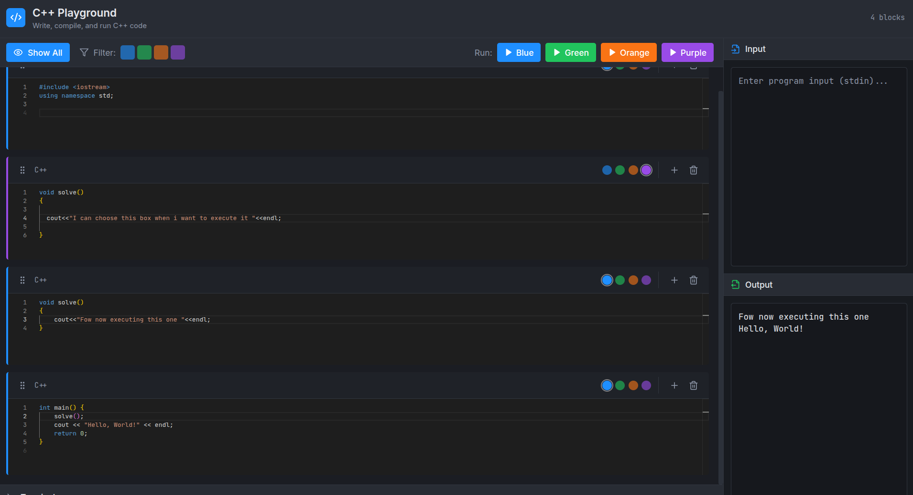
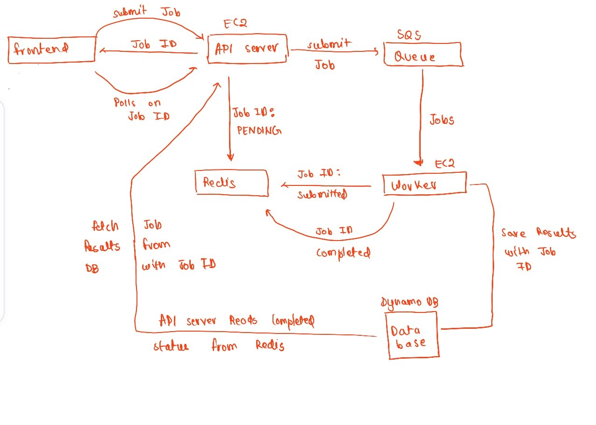

# Boxxy — A Box-Based Online Coding Platform

Boxxy is an online coding platform built to make code execution faster, cleaner, and more flexible, especially for competitive programming and rapid experimentation.

> **Note:** The main aim of this project was for personal use.

Live demo: [http://boxxy.fun](http://boxxy.fun)

---

## Motivation

Traditional online coding platforms rely on a single-editor execution model, which often slows down experimentation and comparison of approaches.  
Boxxy was designed to reduce this friction by enabling parallel thinking and selective execution within the same environment.

---

## Frontend Philosophy and Execution Experience

The primary objective of the frontend is to simplify and streamline code execution on an online platform.  
Instead of forcing users to constantly overwrite or switch between files, Boxxy introduces a box-oriented execution model.

The concept of boxes is fundamental to how the platform works, and the name Boxxy itself reflects this design philosophy.

---

## Box-Oriented Coding Environment

In Boxxy, code is divided into multiple independent boxes, each representing a separate execution context.

- Every box contains self-contained code
- Each box is associated with a distinct color
- Boxes are designed to be executed independently

This approach encourages experimentation while keeping the workspace clean and organized.

---

## Color-Based Selective Execution

Currently, the platform supports four color-coded boxes.

- Selecting a specific color executes only the code inside that box
- Other boxes remain unaffected
- This enables:
  - Parallel development of multiple solutions
  - Side-by-side comparison of approaches
  - Faster iteration without disrupting working code

This model is particularly effective for online competitive programming, where quick testing and frequent changes are essential.

---

## Parallel Workflow in a Single Environment

By allowing multiple execution contexts within the same interface, Boxxy enables a continuous parallel workflow.

Users can:
- Maintain alternate solutions
- Experiment with optimizations
- Keep partial or draft logic alongside final code

All without switching tabs, files, or editors.

---

## Drag-and-Drop Box Management

To improve usability and visual organization:

- Code boxes can be dragged and reordered
- Boxes can be positioned above or below each other
- Logical grouping becomes easier as solutions grow

This makes long coding sessions more manageable and structured.

---

## Frontend Preview

Image placeholder — replace with actual screenshot.

---

## System Architecture

Boxxy follows a decoupled and scalable backend architecture designed to support asynchronous job execution and high concurrency.

---

## Architecture Components

### Frontend
- Manages box-based code input
- Submits execution requests
- Polls for job status and results

### API Server
- Accepts job submissions
- Generates unique Job IDs
- Enqueues jobs into the system
- Serves status and results to the frontend

### Redis
- Stores job state for fast lookups
- Tracks job lifecycle:
  - pending
  - submitted
  - completed

### Amazon SQS
- Acts as a reliable job queue
- Ensures durable and scalable job delivery to workers

### Worker Nodes
- Fetch jobs from SQS
- Execute submitted code
- Update job status in Redis
- Store final results

### DynamoDB
- Persists job execution results
- Indexed by Job ID for fast retrieval

---

## Job Processing Flow

1. Frontend submits a job to the API server  
2. API server generates a unique Job ID  
3. Job ID is stored in Redis with status `pending`  
4. Job is pushed to Amazon SQS  
5. Worker node fetches the job from SQS  
6. Worker updates Redis with status `submitted`  
7. Worker executes the job  
8. Result is stored in DynamoDB using Job ID  
9. Worker updates Redis with status `completed`  
10. Frontend polls API server with Job ID  
11. API server checks Redis  
12. If completed, API server fetches result from DynamoDB  
13. Result is returned to the frontend  

---

## Architecture Diagram

Image placeholder — replace with actual diagram.

---

## Summary

Boxxy provides:
- A box-based execution model
- Color-based selective execution
- Parallel coding workflows
- A scalable backend architecture using Redis, SQS, and DynamoDB

Together, these features create a fast and flexible environment for solving problems efficiently.

---

## Future Improvements

- Custom execution environments
- Persistent box history
- Collaborative editing
- Execution analytics per box

---

## Try It Out

[http://boxxy.fun](http://boxxy.fun)
